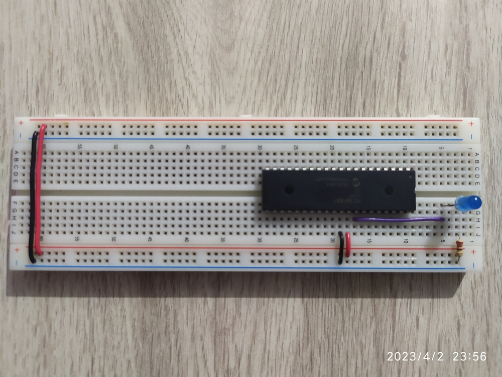
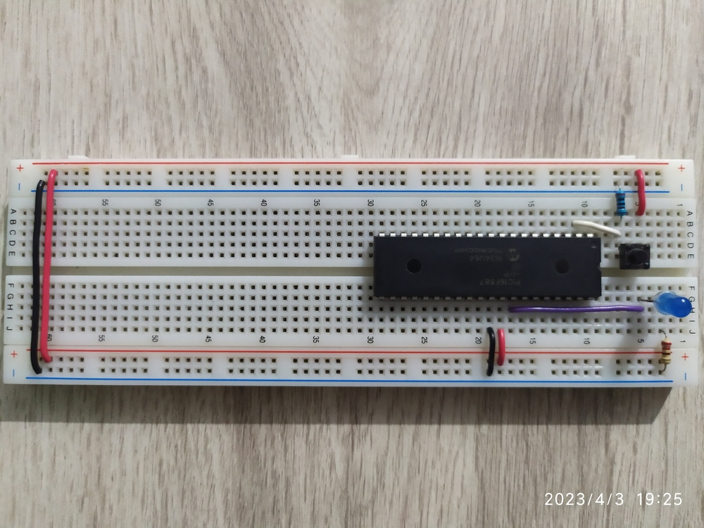
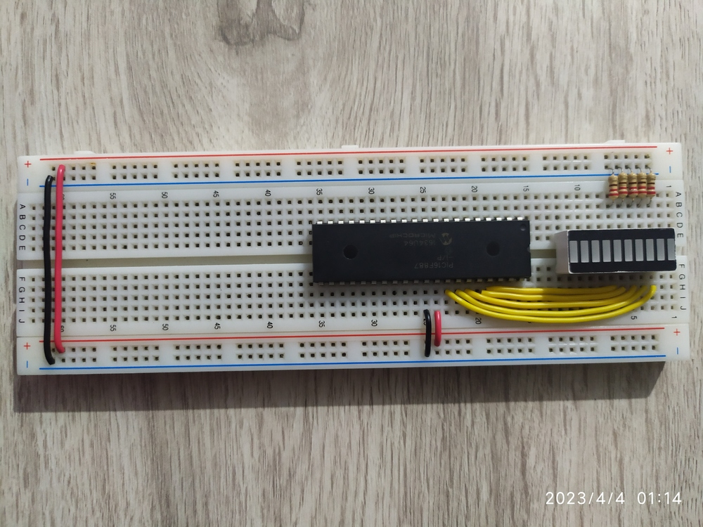
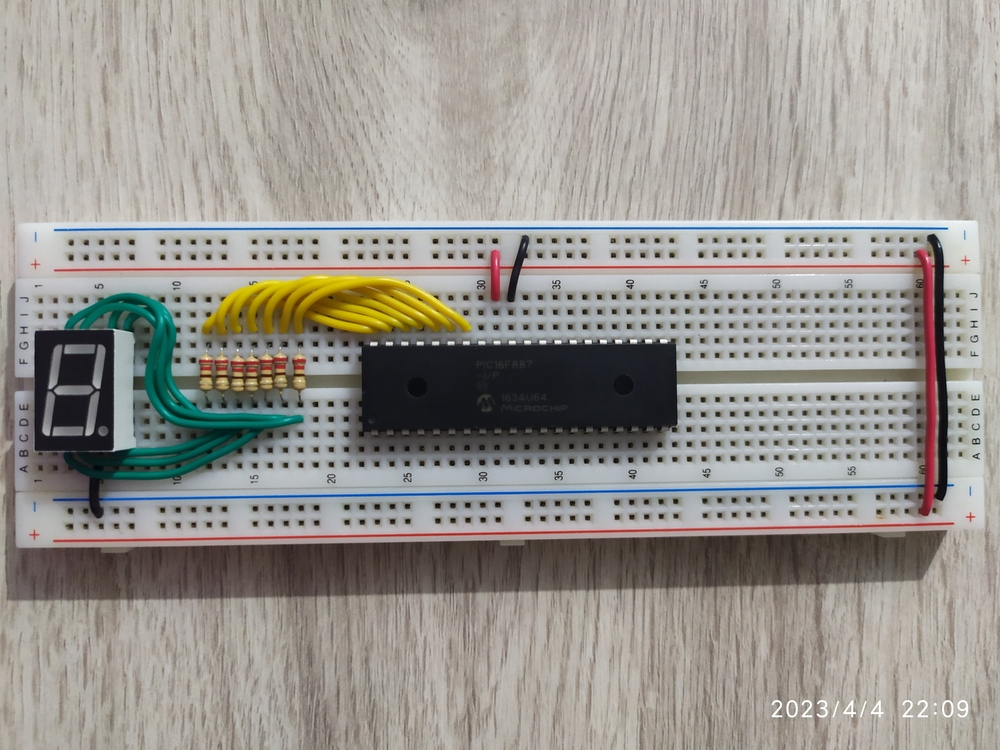
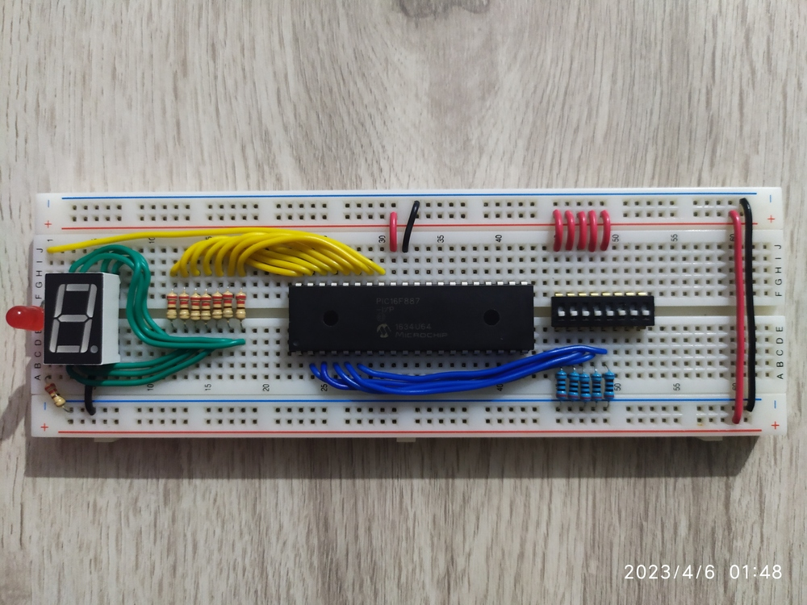
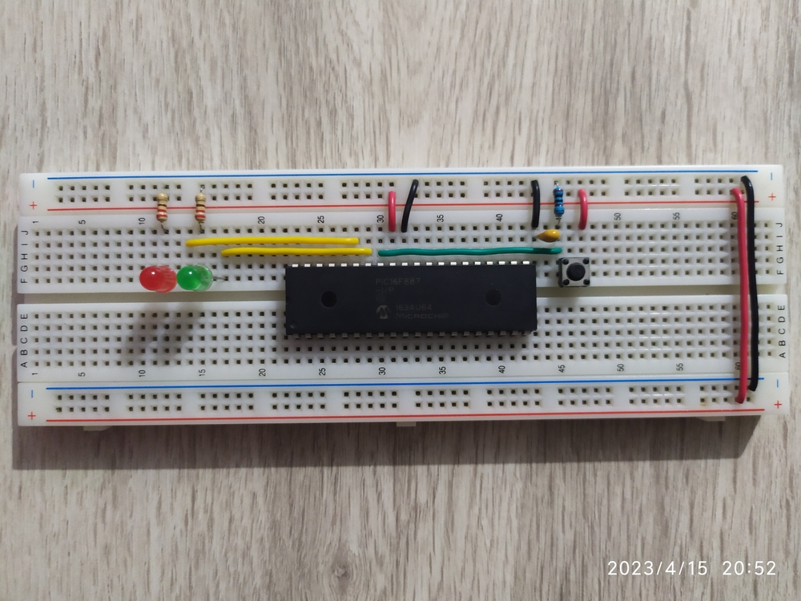
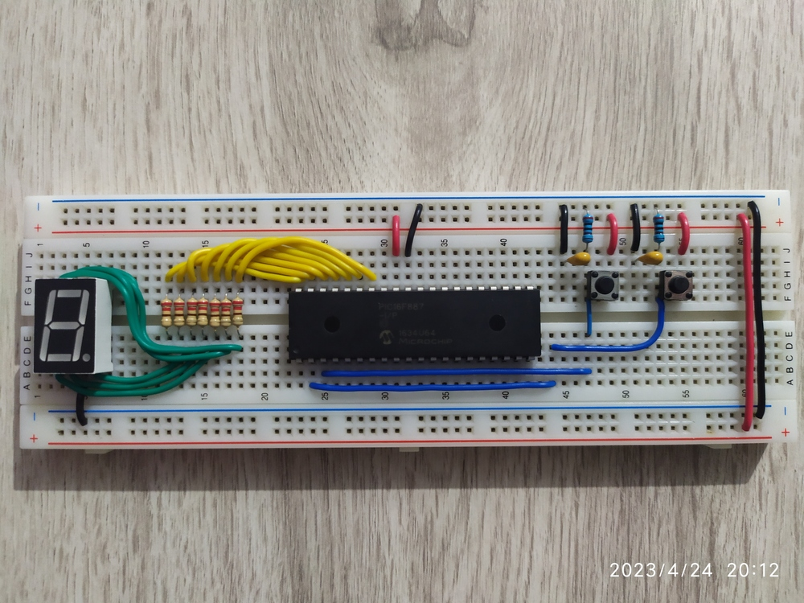
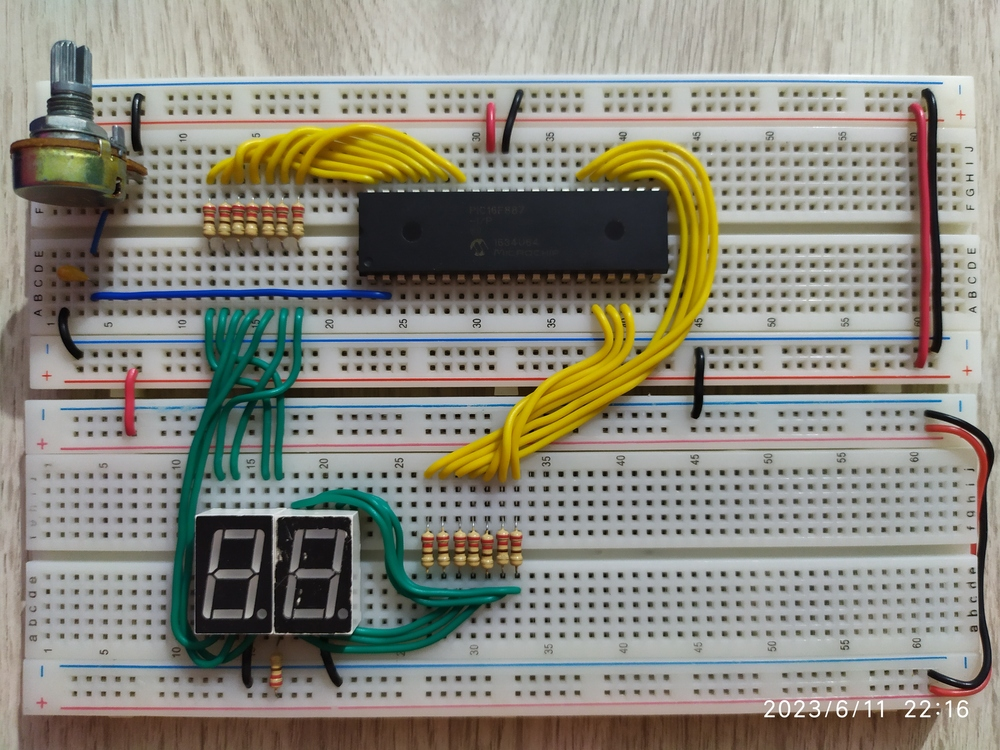
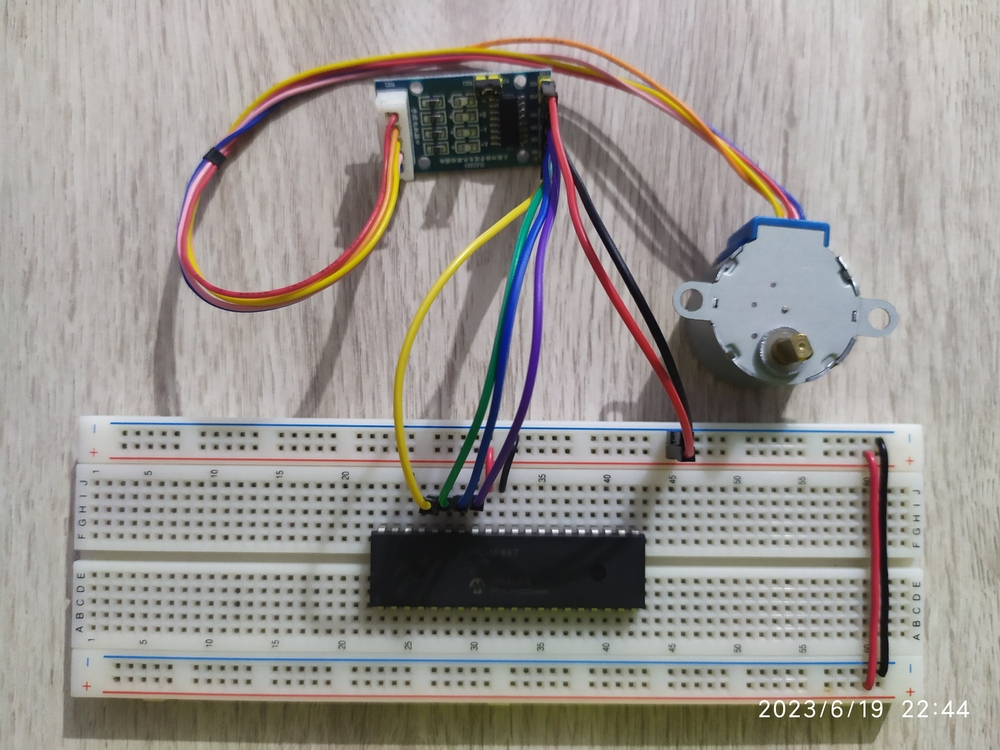

# Sistemas Embebidos *PIC16F887*

## Configuración inicial para el *PIC16F887*

```
// Ian Mu;oz Nu;ez

#include <xc.h>
#include <pic16f887.h>

#pragma config FOSC=INTRC_NOCLKOUT
#pragma config WDTE=OFF
#pragma config PWRTE=OFF
#pragma config MCLRE=OFF
#pragma config CP=OFF
#pragma config CPD=OFF
#pragma config BOREN=OFF
#pragma config IESO=OFF
#pragma config FCMEN=OFF
#pragma config LVP=OFF
#pragma config BOR4V=BOR40V
#pragma config WRT=OFF
```

El código anterior sirve para configurar los osciladores internos del ***PIC***, entre
otros bits de configuración.

## Software y herramientas utilizadas

- ***PIC16F887***.
- Programador ***PICKIT3***.
- [MPLAB X ***v6.05***](https://www.microchip.com/en-us/tools-resources/develop/mplab-x-ide).
- [Compilador ***xc8***](https://www.microchip.com/en-us/tools-resources/develop/mplab-xc-compilers/downloads-documentation#XC8)
- [***SimulIDE***](https://www.simulide.com/p/home.html) ó [***Proteus***](https://www.labcenter.com/)

## [Proyecto 1: Hola mundo](https://github.com/ian16munoz3nunez1/sistemasEmbebidos/tree/proy1)


En el proyecto 1 se hizo un código en ***C*** para hacer parpadear un led con el pin
***RB0*** del ***PIC***.

```
// Ian Mu;oz Nu;ez

#define _XTAL_FREQ 4000000
#define led PORTBbits.RB0

int t = 1000;

void main(void)
{
    TRISB = 0x00;

    while(1)
    {
        led = 1;
        __delay_ms(t);
        led = 0;
        __delay_ms(t);
    }
}
```

## [Proyecto 2: Entradas digitales](https://github.com/ian16munoz3nunez1/sistemasEmbebidos/tree/proy2)


En este proyecto se realizó un código en ***C*** en el que se tiene una entrada digital con un botón
desde el pin ***RA0*** y se tiene una salida digital en el pin ***RB0***.

Al presionar el botón, el led parpadea dos veces.

```
// Ian Mu;oz Nu;ez

#define _XTAL_FREQ 4000000
#define entrada PORTAbits.RA0
#define salida PORTBbits.RB0

int t = 400;

void main(void)
{
    TRISA = 0x01;
    TRISB = 0x00;

    ANSEL = 0x00;
    ANSELH = 0x00;

    while(1)
    {
        if(entrada)
        {
            salida = 1;
            __delay_ms(t);
            salida = 0;
            __delay_ms(t);
            salida = 1;
            __delay_ms(t);
            salida = 0;
        }
        else
            salida = 0;
    }
}
```

## [Proyecto 3: Secuencia binaria con leds](https://github.com/ian16munoz3nunez1/sistemasEmbebidos/tree/proy3)


En el proyecto 3 se escribió un código en ***C*** con el que se muestra en una tira led
una secuencia binaria del 0 al 31.

```
// Ian Mu;oz Nu;ez

#define _XTAL_FREQ 4000000
#define salida PORTB

int t = 300;

void main(void)
{
    TRISB = 0x00;

    while(1)
    {
        for(int i = 0; i <= 31; i++)
        {
            salida = i;
            __delay_ms(t);
        }
    }
}
```

## [Proyecto 4: Secuencia decimal](https://github.com/ian16munoz3nunez1/sistemasEmbebidos/tree/proy4)


En este proyecto se escribió un script en ***C*** en el que se muestra una secuencia
decimal del 0 al 9 en un dislpay de 7 segmentos.

```
// Ian Mu;oz Nu;ez

#define _XTAL_FREQ 4000000
#define salida PORTB

unsigned char numeros[] = {
    0b11111100, //0
    0b01100000, //1
    0b11011010, //2
    0b11110010, //3
    0b01100110, //4
    0b10110110, //5
    0b10111110, //6
    0b11100000, //7
    0b11111110, //8
    0b11100110 //9
    //abcdefg.
};

// unsigned char numeros[] = {
//     0xFC, //0
//     0x60, //1
//     0xDA, //2
//     0xF2, //3
//     0x66, //4
//     0xB6, //5
//     0xBE, //6
//     0xE0, //7
//     0xFE, //8
//     0xE6 //9
// };

int t = 1000;

void main(void)
{
    TRISB = 0x00;

    while(1)
    {
        for(int i = 0; i < 10; i++)
        {
            salida = numeros[i];
            __delay_ms(t);
        }
    }
}
```

## [Proyecto 5: Sumador-Restador de 2x2 bits](https://github.com/ian16munoz3nunez1/sistemasEmbebidos/tree/proy5)


En el proyecto 5 se escribió un script en ***C*** en el que se reciben 5 valores, 4 para
los bits que se quieren sumar o restar y 1 para elegir el modo de resta o suma.

```
// Ian Mu;oz Nu;ez

#define _XTAL_FREQ 4000000
#define a0 PORTAbits.RA0
#define a1 PORTAbits.RA1
#define b0 PORTAbits.RA2
#define b1 PORTAbits.RA3
#define m  PORTAbits.RA4
#define salida PORTB

unsigned char numeros[] = {
    0b11111100, //0
    0b01100000, //1
    0b11011010, //2
    0b11110010, //3
    0b01100110, //4
    0b10110110, //5
    0b10111110 //6
    //abcdefg.
};

int s0, c0, s1, c1, valor;

void main(void)
{
    TRISA = 0x1F;
    TRISB = 0x00;

    ANSEL = 0x00;

    while(1)
    {
        if(m)
        {
            s0 = a0^b0;
            c0 = ~a0&b0;
            s1 = c0^a1^b1;
            c1 = c0&~a1 | b1&~(c0^a1);
            valor = s0*1 + s1*2 + c1*4;
            if(valor > 3)
            {
                valor = ~valor - 0b11111000;
                valor = 0b0001 + valor;
                salida = numeros[valor] + 1;
            }
            else
                salida = numeros[valor];
        }
        else
        {
            s0 = a0^b0;
            c0 = a0&b0;
            s1 = c0^a1^b1;
            c1 = c0&a1 | b1&(c0^a1);
            valor = s0*1 + s1*2 + c1*4;
            salida = numeros[valor];
        }
    }
}
```

## [Proyecto 6: Interrupciones](https://github.com/ian16munoz3nunez1/sistemasEmbebidos/tree/proy6)


En este proyecto se hizo un script en ***C*** para generar interrupciones externas en el
***PIC***, al presionar el botón se genera la interrupción, por lo que el programa
principal se detiene y se ejecuta el código de la interrupción.

```
// Ian Mu;oz Nu;ez

#define _XTAL_FREQ 4000000
#define boton    PORTBbits.RB0
#define ledVerde PORTBbits.RB1
#define ledRojo  PORTBbits.RB2

const int tVerde = 500; // Delay para el led verde
const int tRojo = 200; // Delay para el led rojo

// Funcion de interrupcion
void __interrupt() interrupcion(void)
{
    if(INTCONbits.INTF)
    {
        for(int i = 0; i < 5; i++)
        {
            ledRojo = 1;
            __delay_ms(tRojo);
            ledRojo = 0;
            __delay_ms(tRojo);
        }
        INTCONbits.INTF = 0; // Se asigna 0 a la bandera de interrupcion
    }
}

void main(void)
{
    TRISB = 0x01;
    ANSELH = 0x00;

    OPTION_REGbits.INTEDG = 1; // Activar interrupcion en flanco de subida
    INTCONbits.GIE = 1; // Habilitar interrupcion global
    INTCONbits.INTE = 1; // Habilitar interrupcion externa por pin
    INTCONbits.INTF = 0; // Resetear bandera de interrupcion

    while(1)
    {
        ledVerde = 1;
        __delay_ms(tVerde);
        ledVerde = 0;
        __delay_ms(tVerde);
    }
}
```

# [Proyecto 7: Incremento-Decremento por botón](https://github.com/ian16munoz3nunez1/sistemasEmbebidos/tree/proy7)


En este proyecto se escribió un script en ***C*** con el que tienen dos entradas, ambas
con botones, al presionar uno, el contador incrementa y muestra el valor actual de este
en el display, mientras que otro botón hace que el contador decremente.

```
// Ian Mu;oz Nu;ez

#define _XTAL_FREQ 4000000
#define asc PORTAbits.RA0
#define desc PORTAbits.RA1
#define salida PORTB

unsigned char numeros[] = {
    0b11111100, //0
    0b01100000, //1
    0b11011010, //2
    0b11110010, //3
    0b01100110, //4
    0b10110110, //5
    0b10111110, //6
    0b11100000, //7
    0b11111110, //8
    0b11100110 //9
    //abcdefg.
};

void main(void)
{
    int i=0;

    TRISA = 0x03;
    TRISB = 0x00;

    ANSEL = 0x00;

    while(1)
    {
        if(asc)
        {
            __delay_ms(200);
            while(asc){NOP();}
            i++;
        }

        if(desc)
        {
            __delay_ms(200);
            while(desc){NOP();}
            i--;
        }

        if(i > 9) i = 0;
        if(i < 0) i = 9;

        salida = numeros[i];
    }
}
```

## [Proyecto 8: Voltímetro](https://github.com/ian16munoz3nunez1/sistemasEmbebidos/tree/proy8)


En el proyecto 8 se hizo un script en ***C*** con el que se tiene la entrada desde un
potenciómetro, la señal que entra se convierte de analógica a digital, luego de esto se
muestra en dos displays de 7 segmentos el voltaje de entrada que llega al ***PIC***.

```
// Ian Mu;oz Nu;ez

#define _XTAL_FREQ 4000000 // Configuracion de la frecuencia en 4MHz
#define decimal PORTB // Definicion del puerto B con el nombre 'decimal'
#define unidad PORTC // Definicion del puerto C con el nombre 'unidad'

// Arreglo de caracteres para mostrar los numeros
unsigned char numeros[] = {
    0b11111100, //0
    0b01100000, //1
    0b11011010, //2
    0b11110010, //3
    0b01100110, //4
    0b10110110, //5
    0b10111110, //6
    0b11100000, //7
    0b11111110, //8
    0b11100110
    //abcdefg.
};

int analogRead(int); // Prototipo de la funcion para lecuras analogicas

void main(void)
{
    TRISB = 0x00; // Configuracion de los pines del puerto B como salidas
    TRISC = 0x00; // Configuracion de los pines del puerto C como salidas
    ANSEL = 0xFF; // Activacion de las lecturas analogicas

    while(1)
    {
        int valor = analogRead(0); // Lectura analogica desde el canal 0 (AN0/RA0)
        // Valor dividido entre 204 para dividir 1023 en 5 partes
        decimal = numeros[valor/204];
        // Modulo dividido entre 21 para dividir 204 en 10 partes
        unidad = numeros[(valor%204)/21];
    }
}

int analogRead(int canal)
{
    ADCON1 = 0x80; // Justificacion de lectura analogica a la derecha
    ADCON0bits.ADCS = 0b01; // Reloj de conversion/Velocidad de conversion
    ADCON0bits.CHS = canal; // Canal analogico para la lectura
    ADCON0bits.ADON = 1; // Activacion de la conversion analogica-digital

    ADCON0bits.GO = 1; // Encendido del conversor
    while(ADCON0bits.GO == 1){NOP();}
    int valor = (ADRESH<<8)+ADRESL; // Valor digital obtenido

    return valor;
}
```

## [Proyecto 9: Motor a pasos](https://github.com/ian16munoz3nunez1/sistemasEmbebidos/tree/proy9)


En este proyecto se escribió un script en ***C*** para controlar el giro de un motor a
pasos ***28BYJ-48***, en el código se crearon distintas secuencias para los pasos del
motor.

```
// Ian Mu;oz Nu;ez

#define _XTAL_FREQ 4000000 // Configuracion de la frecuencia en 4MHz
#define motor PORTB // Definicion del puerto B como 'motor'

// Arreglo para un paso a la vez
unsigned char unPaso[] = {
    0b00001000,
    0b00000100,
    0b00000010,
    0b00000001
};

// Arreglo para dos pasos a la vez
unsigned char dosPasos[] = {
    0b00001100,
    0b00000110,
    0b00000011,
    0b00001001
};

// Arreglo para la configuracion a medio paso del motor
unsigned char medioPaso[] = {
    0b00001000,
    0b00001100,
    0b00000100,
    0b00000110,
    0b00000010,
    0b00000011,
    0b00000001,
    0b00001001
};

int t = 5; // Tiempo de espera entre cada paso

void main(void)
{
    TRISB = 0x00; // Configuracion de los pines del puerto B como salidas

    while(1)
    {
        for(int i = 0; i < 4; i++)
        {
            motor = dosPasos[i]; // Paso actual del motor
            __delay_ms(t); // Espera de un cierto periodo de tiempo
        }
    }
}
```

Como segunda parte del proyecto, se creo un código para conrolar la posición del motor.
El código resultante es:

```
// Ian Mu;oz Nu;ez

#define _XTAL_FREQ 4000000 // Configuracion de la frecuencia en 4MHz
#define motor PORTB // Definicion del puerto B como 'motor'

// Arreglo para un paso a la vez en sentido horario
unsigned char unPasoCW[] = {
    0b00001000,
    0b00000100,
    0b00000010,
    0b00000001
};
// Arreglo para un paso a la vez en sentido antihorario
unsigned char unPasoCCW[] = {
    0b00000001,
    0b00000010,
    0b00000100,
    0b00001000
};

// Arreglo para dos pasos a la vez en sentido horario
unsigned char dosPasosCW[] = {
    0b00001100,
    0b00000110,
    0b00000011,
    0b00001001
};
// Arreglo para dos pasos a la vez en sentido antihorario
unsigned char dosPasosCCW[] = {
    0b00000011,
    0b00000110,
    0b00001100,
    0b00001001
};

// Arreglo para la configuracion a medio paso del motor en sentido horario
unsigned char medioPasoCW[] = {
    0b00001000,
    0b00001100,
    0b00000100,
    0b00000110,
    0b00000010,
    0b00000011,
    0b00000001,
    0b00001001
};
// Arreglo para la configuracion a medio paso del motor en sentido antihorario
unsigned char medioPasoCCW[] = {
    0b00000001,
    0b00000011,
    0b00000010,
    0b00000110,
    0b00000100,
    0b00001100,
    0b00001000,
    0b00001001
};

int analogRead(); // Prototipo de la funcion para lecturas analogicas
int t = 2; // Tiempo de espera entre cada paso

void main(void)
{
    TRISB = 0x00; // Configuracion de los pines del puerto B como salidas
    ANSEL = 0x01; // Activacion de la lectura analogica por el pin RA0
    ADCON1 = 0x80; // Lectura analogica justificada a la derecha

    int i=0; // Variables para los pasos del motor
    int pasos=4; // Numero de pasos para llegar a un angulo de 5.625: 4/8
    // Angulo del motor, angulo deseado, error entre el angulo actual y deseado
    float angle=0, valor, error;

    while(1)
    {
        valor = analogRead()*0.3519; // Valor leido multiplicado por 360/1023
        error = valor-angle; // Error calculado

        if(error > 3)
        {
            __delay_ms(t); // Espera de t milisegundos
            motor = dosPasosCW[i]; // Paso siguiente en sentido horario
            angle += 0.1757; // Incrementa el valor del angulo
            i++; // Incrementa el iterador de pasos
        }

        if(error < -3)
        {
            __delay_ms(t); // Espera de t milisegundos
            motor = dosPasosCCW[i]; // Paso siguiente en sentido antihorario
            angle -= 0.1757; // Decrementa el valor del angulo
            i++; // Incrementa el iterador de pasos
        }

        if(i == pasos)
        {
            i = 0; // Si el iterador de pasos llega al limite, inicia de nuevo
        }
    }
}

int analogRead()
{
    ADCON0bits.ADCS = 0b01; // Reloj de conversion / Velocidad de conversion
    ADCON0bits.CHS = 0; // Canal analogico para la lectura
    ADCON0bits.ADON = 1; // Activacion de la lectura analogica-digital

    ADCON0bits.GO = 1; // Encendido del conversor
    while(ADCON0bits.GO == 1){NOP();} // Mientras el conversor este encendido, no hay operacion
    int valor = (ADRESH<<8)+ADRESL; // Valor digital obtenido

    return valor;
}
```
